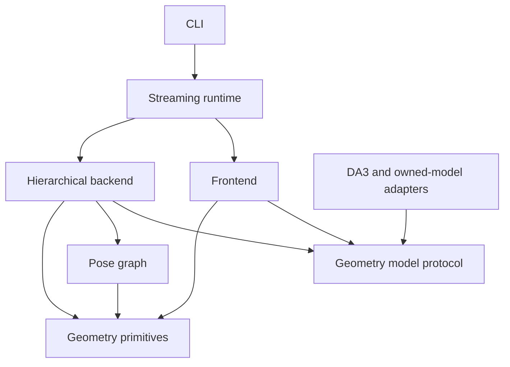

# Architecture and review guide

## Read in this order

1. `types.py`: the model boundary (`Frame`, `Reconstruction`, `GeometryModel`).
2. `geometry.py`: transform conventions and numerical operations.
3. `graph.py`: the optimization objective, gauge fixing and robust residuals.
4. `frontend.py`: compact tracking context and backend correction feedback.
5. `backend.py`: local windows, long-context constraints and loop verification.
6. `runtime.py`: thread ownership, scheduling, persistence and shutdown.
7. `evaluation.py`: metric definitions and timestamp association.
8. `adapters.py`: how DA3, owned PyTorch checkpoints and ONNX satisfy the interface.
9. `models.py`, `losses.py`, `training.py`: optional future training experiments.

The CLI only assembles these components. Dataset conversion and map export are
standalone scripts. Numerical code does not depend on the CLI or filesystem.

## Dependency direction

## Coordinate contract

| Value | Convention |
|---|---|
| RGB | HWC, uint8, RGB order |
| Timestamp | finite seconds, strictly increasing within sequence |
| Frame index | contiguous processed-frame index, independent of capture drops |
| Pose | `T_world_camera`, 4×4, column vectors, translation in last column |
| Camera axes | OpenCV: x right, y down, z forward |
| Depth | optical-axis z-depth, not Euclidean range |
| Intrinsics | 3×3, in pixels at the returned depth-map resolution |
| Model scale | arbitrary shared scale for depth and translation unless calibrated |
| Sim(3) | `x_target = s R x_source + t`, positive scale |
| Tangent | `[v_x,v_y,v_z,omega_x,omega_y,omega_z,log_scale]` |
| Graph node | `T_world_submap` as Sim(3) |
| Edge i,j | `T_submap_i_submap_j`; residual compares against inverse(i)·j |
| Quaternions on disk | TUM xyzw |

These conventions are tested at adapter boundaries. DA3's world-to-camera
extrinsics are inverted and reordered explicitly. Scale never enters the 3×3
rotation block of an emitted rigid camera pose.

## State and concurrency

The caller owns the frontend and its trajectory. A single worker owns the
backend, submaps and pose graph. Backend results become visible only when a
future completes. Each side has a separate model instance and frame-cache
instance; both may read persisted frame files after the caller finishes writing.
There are no simultaneous graph writes.

One backend job may be pending. At the next mandatory map boundary the caller
waits for it, applies corrections, then submits the next window. This preserves
span-2 overlap under load. Camera acquisition runs in a separate thread with a
capacity-one queue, so overload drops old captures rather than growing memory.
Benchmark replay is synchronous by default and never drops frames.

Delayed graph corrections revise stored past poses and propagate a similarity
correction through the unmapped tail. The new anchor depth establishes scale
for subsequent tracking. `trajectory_online.tum` preserves original outputs;
`trajectory.tum` contains corrected estimates. An app must account for map-frame
revisions when anchoring content; no smoothing policy is silently imposed.

## Failure and resource behavior

Invalid timestamps, corrupt tensor shapes, insufficient depth inliers and model
failures raise explicit exceptions. Worker failures are rethrown on collection
or close. The system does not silently replace failed tracking with identity
poses. Resume of a SLAM run is not implemented; use a new run directory.

RGB/depth tensors are stored on disk with a bounded LRU cache. Graph nodes,
retrieval descriptors and trajectory metadata grow with run length. Optimization
uses sparse finite-difference least squares and reference exp/log operations;
large-scale incremental optimization and a native geometry port are future
performance work. Point-cloud export can contain overlapping/duplicate surfaces.

## Extending safely

Implement `GeometryModel.reconstruct` to add a model. Keep preprocessing and
weight loading in its adapter. Add a dataset converter that emits the manifest
instead of inserting dataset logic into the tracker. Add an edge source in the
backend while preserving the direction contract. Validate every change with
known-transform fixtures before comparing learned-model trajectories.
