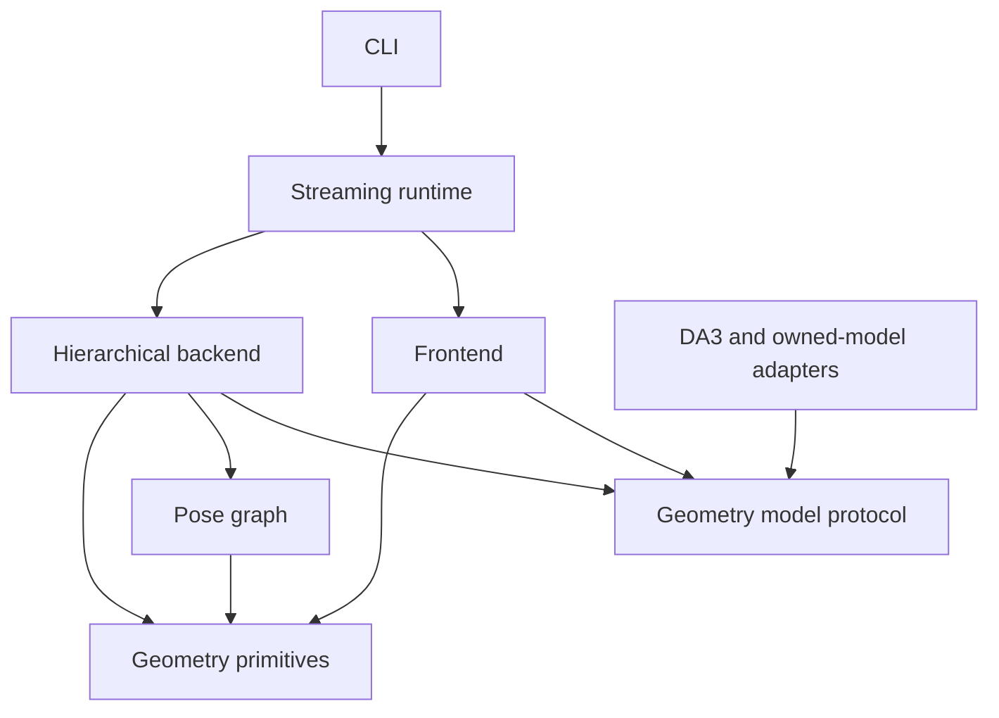

# Architecture and review guide

## Read in this order

1. `types.py`: the model boundary (`Frame`, `Reconstruction`, `GeometryModel`).
2. `geometry.py`: transform conventions and numerical operations.
3. `graph.py`: the optimization objective, gauge fixing and robust residuals.
4. `frontend.py`: compact tracking context and backend correction feedback.
5. `backend.py`: local windows, long-context constraints and loop verification.
6. `runtime.py`: thread ownership, scheduling, persistence and shutdown.
7. `evaluation.py`: metric definitions and timestamp association.
8. `adapters.py`: how DA3, owned PyTorch checkpoints and ONNX satisfy the interface.
9. `models.py`, `losses.py`, `training.py`: optional future training experiments.

The CLI only assembles these components. Dataset conversion and map export are
standalone scripts. Numerical code does not depend on the CLI or filesystem.

## Dependency direction



## Coordinate contract

| Value | Convention |
|---|---|
| RGB | HWC, uint8, RGB order |
| Timestamp | finite seconds, strictly increasing within sequence |
| Frame index | contiguous processed-frame index, independent of capture drops |
| Pose | `T_world_camera`, 4×4, column vectors, translation in last column |
| Camera axes | OpenCV: x right, y down, z forward |
| Depth | optical-axis z-depth, not Euclidean range |
| Intrinsics | 3×3, in pixels at the returned depth-map resolution |
| Model scale | arbitrary shared scale for depth and translation unless calibrated |
| Sim(3) | `x_target = s R x_source + t`, positive scale |
| Tangent | `[v_x,v_y,v_z,omega_x,omega_y,omega_z,log_scale]` |
| Graph node | `T_world_submap` as Sim(3) |
| Edge i,j | `T_submap_i_submap_j`; residual compares against inverse(i)·j |
| Quaternions on disk | TUM xyzw |

These conventions are tested at adapter boundaries. DA3's world-to-camera
extrinsics are inverted and reordered explicitly. Scale never enters the 3×3
rotation block of an emitted rigid camera pose.

## State and concurrency

Concurrent execution is the default in the Python API, CLI, and TUM runner.
The stages have explicit ownership:

| Stage | Owner | Work |
|---|---|---|
| Live capture | Capture thread | Latest-frame queue, capacity one |
| Tracking | Caller thread | Frame persistence, frontend inference, applying completed corrections |
| Local mapping | `amber-mapping` worker | View selection, local reconstruction, metric scale, interpolation |
| Graph processing | `amber-graph` worker | Submap persistence/alignment, long context, loop verification, optimization, corrected trajectory |

Local mapping of window N+1 can overlap graph work for window N, while the caller
tracks newer frames. Two outstanding windows are allowed by default, including
active jobs and completed corrections not yet collected. Set
`max_pending_windows` / `--max-pending-windows` to change this bound. At capacity,
submission waits for the oldest correction only. No mandatory mapping windows
are dropped, preserving window/3 stride and span-2 overlap. Live capture can still
drop stale inputs; manifest/TUM replay processes every selected input.

Frontend and backend must use distinct model instances in concurrent mode.
Local mapping and graph-side loop/long-context inference share a backend model
lock: those inference calls serialize, but graph geometry and optimization can
overlap local inference. This avoids a third checkpoint copy. Python threads do
not guarantee parallel Python bytecode or simultaneous GPU kernels. CPU thread
oversubscription, shared GPU capacity, and memory pressure can negate the benefit.

Only the graph worker mutates graph/retrieval state or submap files. The caller
finishes each frame write before submitting it; graph and caller use separate
frame caches. Inputs and configuration must not be mutated during a run. Prepared
submaps transfer to graph ownership; corrections transfer to caller ownership.
Live statistics read completed-message snapshots rather than mutable graph state.
Public `push`, `close`, `trajectory`, and `statistics` calls belong to one caller
thread; they are not a multi-producer API.

Corrections are consumed FIFO on push, backpressure, or close. Close drains all
submitted jobs, maps any remaining tail, then joins both workers. An error cancels
queued jobs and joins active work before returning; native calls that hang cannot
be forcibly interrupted by this thread-based runtime. Worker errors propagate
through push/close; a caller exception remains the primary error on context exit.

Use `--no-async-backend` (or `asynchronous=False`) for the sequential reference.
Concurrent correction arrival depends on scheduling, so online trajectories and
confidence-based view selection can differ from the sequential run even with
the same inputs. Final parity tests use deterministic oracle geometry; learned
model accuracy and device throughput must be measured separately in both modes.

Delayed graph corrections revise stored past poses and propagate a similarity
correction through the unmapped tail. The new anchor depth establishes scale
for subsequent tracking. `trajectory_online.tum` preserves original outputs;
`trajectory.tum` contains corrected estimates. An app must account for map-frame
revisions when anchoring content; no smoothing policy is silently imposed.

## Failure and resource behavior

Invalid timestamps, corrupt tensor shapes, insufficient depth inliers and model
failures raise explicit exceptions. Worker failures are rethrown on collection
or close. The system does not silently replace failed tracking with identity
poses. Resume of a SLAM run is not implemented; use a new run directory.

RGB/depth tensors are stored on disk with a bounded LRU cache. Graph nodes,
retrieval descriptors and trajectory metadata grow with run length. Optimization
uses sparse finite-difference least squares and reference exp/log operations;
large-scale incremental optimization and a native geometry port are future
performance work. Point-cloud export can contain overlapping/duplicate surfaces.

## Extending safely

Implement `GeometryModel.reconstruct` to add a model. Keep preprocessing and
weight loading in its adapter. Add a dataset converter that emits the manifest
instead of inserting dataset logic into the tracker. Add an edge source in the
backend while preserving the direction contract. Validate every change with
known-transform fixtures before comparing learned-model trajectories.

## Static contracts and checks

All Python function parameters and returns in `src`, `scripts` and `tests` carry
annotations; Ruff's `ANN` rules enforce this. `contracts.py` defines the manifest,
training configuration, metrics and report `TypedDict` schemas. `GeometryModel`
and `CandidateRetriever` are the model and retrieval protocols. Async results
use `Future[BackendUpdate]`; frame queues and caches have explicit element types.

NumPy uses the shared `Array = NDArray[Any]` alias because several boundaries accept
mixed floating/integer dtypes. Tensor shapes, coordinate conventions and finite
values remain runtime contracts rather than promises made by Python's type system.
`JsonObject` is reserved for open JSON metadata. Upstream DA3 is not fully typed;
its outputs are checked by `Reconstruction.validate` before entering geometry.
Pyrefly checks our project, including test doubles and scripts. Only missing optional
DA3/evo imports are allowed when those extras are absent in fast CI.

```bash
uv run --no-sync ruff check .
uv run --no-sync ruff format --check .
uv run --no-sync pyrefly check
```

`benchmark.py` keeps evaluation separate from inference: the tracker receives no
motion-capture poses or sensor depth. `scripts/benchmark_tum.py` owns downloads,
checkpoint selection and CPU thread limits. See [BENCHMARKS.md](BENCHMARKS.md).

