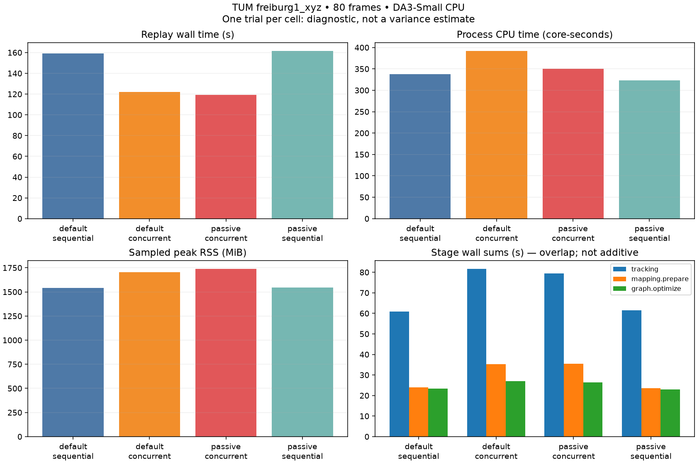

# Fresh matched runtime diagnostics



One fresh process per policy/mode on the same 80 TUM freiburg1_xyz RGB frames, same pinned DA3-Small checkpoint, resolution 168, window 12, and two-thread numerical-library limits. Order: default sequential, default concurrent, passive concurrent, passive sequential. OMP_WAIT_POLICY=PASSIVE is the sole intentional policy change. Results are separate from the earlier historical six-run summary; no cross-session causal comparison is claimed.

| Trial | Replay s | FPS | CPU s | CPU % | RSS MiB | USS MiB | ATE m | Online ATE m |
|---|---:|---:|---:|---:|---:|---:|---:|---:|
| [default_sequential](default_sequential/rgbd_dataset_freiburg1_xyz/results.json) | 159.174 | 0.503 | 338.117 | 212.4 | 1541.9 | 1537.9 | 0.1409 | 0.1418 |
| [default_concurrent](default_concurrent/rgbd_dataset_freiburg1_xyz/results.json) | 121.854 | 0.657 | 391.787 | 321.5 | 1706.2 | 1715.8 | 0.1355 | 0.1500 |
| [passive_concurrent](passive_concurrent/rgbd_dataset_freiburg1_xyz/results.json) | 119.246 | 0.671 | 349.798 | 293.3 | 1737.3 | 1731.8 | 0.1355 | 0.1498 |
| [passive_sequential](passive_sequential/rgbd_dataset_freiburg1_xyz/results.json) | 161.483 | 0.495 | 323.210 | 200.1 | 1546.4 | 1542.4 | 0.1409 | 0.1418 |

## Stage and scheduling evidence

Stage times can overlap, and graph.integrate includes graph.optimize. Do not add them into an end-to-end runtime. Caller-thread CPU excludes native worker CPU. The full event spans are in each trial's profile/stages.json; resource timelines are in profile/samples.csv.

| Trial | Tracking s | Mapping s | Graph optimize s | Graph integrate s | Calls/views | Throttled s | Major faults | Storage reads MiB |
|---|---:|---:|---:|---:|---:|---:|---:|---:|
| default_sequential | 60.946 | 23.928 | 23.316 | 71.235 | 123/597 | 0.000 | 8 | 11.863 |
| default_concurrent | 81.593 | 35.351 | 26.922 | 86.976 | 123/632 | 0.000 | 0 | 0.000 |
| passive_concurrent | 79.337 | 35.516 | 26.457 | 85.274 | 123/632 | 0.000 | 0 | 0.000 |
| passive_sequential | 61.497 | 23.585 | 23.015 | 73.475 | 123/597 | 0.000 | 0 | 0.000 |

## Scope and validation

The replay timer excludes checkpoint loading/download, hashes, plotting, and evaluation. It includes RGB decoding, frame persistence, tracking, mapping, graph optimization, backpressure and final drain. Process CPU and sampled RSS/USS include both models and profiler overhead. 100% CPU means one core. Peaks use nominal 200 ms sampling; actual gaps are saved. No GPU is present. Cgroup counters cover the container, potentially including other processes; they do not measure all host scheduling/frequency effects. Source/input/checkpoint/configuration hashes match across the four runs. Independent evo checks of both trajectories are in validation.json. One trial per cell cannot establish that a policy eliminates variance.

Raw results retain CPU user/system time, utilization, RSS/USS, thread count, I/O, page faults, context switches, cgroup throttling, queue backpressure, stage spans, trajectories and environment metadata. Large frame/submap caches are excluded from Git; recreate them by rerunning the commands.

```bash
uv sync --locked --extra da3 --extra benchmark
uv run --no-sync python scripts/profile_tum_matrix.py --output reports/new_diagnostics
uv run --no-sync python scripts/report_profile_matrix.py reports/new_diagnostics
```

The matrix downloads the standard TUM archive if needed, verifies its checksum and pins checkpoint revision e08cab65ca0ec38e7826075418411ab90cab4da3. Some proxy environments need the environment-only helper `uv pip install socksio` for Hugging Face downloads.
