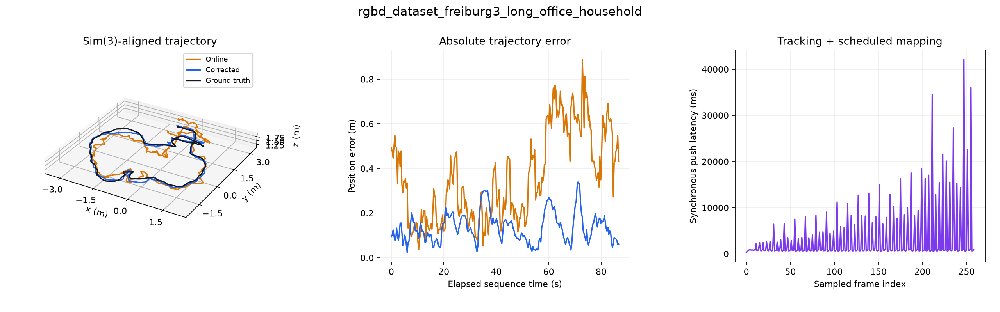

# Full-route indoor benchmarking

## Completed local office-route baseline

[Detailed report](freiburg3_long_office_household_sequential_1/README.md)

| Metric | Sequential |
|---|---:|
| RGB samples across full route | 259 |
| Samples matched to ground truth | 258 |
| Replay time | 861.757 s |
| Process CPU time | 1795.577 core-s |
| Sampled peak RSS | 1572.6 MiB |
| Online ATE RMSE | 0.4118 m |
| Corrected ATE RMSE | 0.1505 m |
| Graph optimization wall time | 452.299 s |
| Submaps / edges | 63 / 205 |
| Accepted loop edges | 22 |

Both trajectories were independently checked with evo. Settings: DA3-Small for both models, CPU, resolution 168, two numerical-library threads, every tenth original RGB frame, no frame-count cap. Downloads and model loading are outside replay time. This is a single exploratory trial, not a variance estimate.

The first update containing loop edges reached the tracker at replay time 601.3 s, after 224 frames. It linked submap 53 back to submaps 0–2. The full [loop/correction timeline](freiburg3_long_office_household_sequential_1/rgbd_dataset_freiburg3_long_office_household/loop_corrections.json) preserves every update. Accepted edges are algorithm decisions, not independently verified closures.

## Execution interruption and continuation

The local execution workspace reset during the following concurrent trial. The completed sequential run, raw resource timeline, stage spans, correction timeline, trajectories, validation and diagnostic image had already been committed and are preserved here. The incomplete concurrent run and downloaded input data were lost; no result is claimed for that run.

[Full-route TUM profiling workflow](../../.github/workflows/route-benchmark.yml) reruns **both modes on the same GitHub runner** for long_office_household and room, preserving a matched comparison independently of workspace lifetime. Its artifact includes every report image and raw profile, including partial diagnostics if a job fails. Do not compare its runtime directly with this local baseline: hardware differs. The CI artifact is named `full-route-tum-profiling` and retained for 90 days.

KITTI 07 and 00 remain the next scale tests. Official downloads require login, so those sequences have not been benchmarked. Provide the downloaded odometry sequences plus calibration, timestamps and ground-truth poses to proceed.

CI continuation: [workflow run](https://github.com/johnhenning/amb3r-slam/actions/runs/36189005277).
