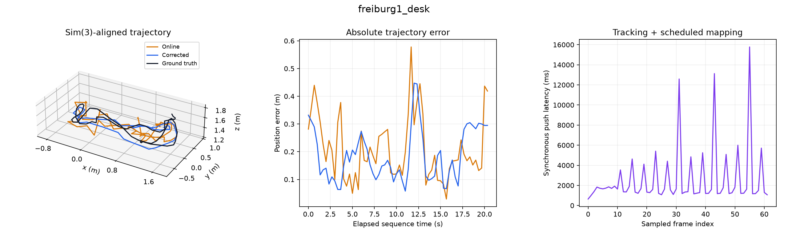
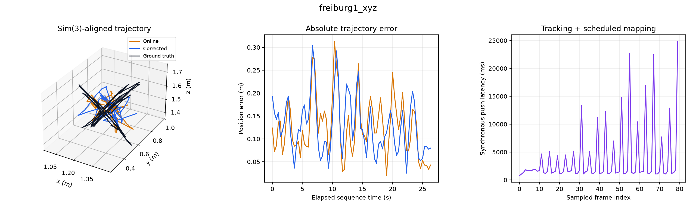

# TUM RGB-D checkpoint benchmark

These are measured results from our independent implementation, not published AMB3R-SLAM results.

## Protocol

- Python 3.12.14; CPU; 2 PyTorch threads.
- DA3-Small in both frontend/backend roles; processing resolution 168 (long edge before patch-size rounding).
- RGB-only input: no sensor depth, calibration, or ground-truth poses are supplied to SLAM.
- Every tenth original RGB frame across each sequence; no accuracy-based frame selection.
- Synchronous backend; window 12, stride 3; loop retrieval and long-context enabled.
- Each online/corrected trajectory gets its own full-trajectory Sim(3) alignment to motion-capture ground truth.
- One-to-one timestamp matching within 20 ms. RPE uses consecutive matched sampled frames, not a fixed one-second interval.
- FPS includes image loading, persistence, mapping, graph optimization and final flush; excludes model loading and plotting.
- BLAS/OpenMP thread limits match the PyTorch thread limit; shared development container, not dedicated hardware.
- One completed run per sequence; no confidence intervals or hardware real-time claim.

## Results

| Sequence | Frames | Matched | Online ATE (m) | Corrected ATE (m) | RPE trans. (m) | RPE rot. (deg) | FPS |
|---|---:|---:|---:|---:|---:|---:|---:|
| rgbd_dataset_freiburg1_desk | 62 | 62 | 0.2397 | 0.2100 | 0.0907 | 7.642 | 0.376 |
| rgbd_dataset_freiburg1_xyz | 80 | 80 | 0.1418 | 0.1409 | 0.0748 | 3.268 | 0.274 |

All errors in the table are RMSE; lower is better. Sim(3) fitting removes global scale error and does not establish metric-scale accuracy.

## rgbd_dataset_freiburg1_desk

Sampled 62 of 613 RGB frames over 20.34 s; 100.0% matched ground truth. Backend: 14 submaps, 35 edges. Push p50/p95: 1530.1/5984.2 ms.

[Metrics and configuration](rgbd_dataset_freiburg1_desk/results.json) · [Corrected trajectory](rgbd_dataset_freiburg1_desk/trajectory.tum) · [Online trajectory](rgbd_dataset_freiburg1_desk/trajectory_online.tum) · [Latency samples](rgbd_dataset_freiburg1_desk/latency.csv)

## rgbd_dataset_freiburg1_xyz

Sampled 80 of 798 RGB frames over 26.34 s; 100.0% matched ground truth. Backend: 18 submaps, 68 edges. Push p50/p95: 1502.6/14918.4 ms.

[Metrics and configuration](rgbd_dataset_freiburg1_xyz/results.json) · [Corrected trajectory](rgbd_dataset_freiburg1_xyz/trajectory.tum) · [Online trajectory](rgbd_dataset_freiburg1_xyz/trajectory_online.tum) · [Latency samples](rgbd_dataset_freiburg1_xyz/latency.csv)

## Findings

All 142 sampled frames produced poses and matched ground truth. Backend correction reduced desk ATE from 0.2397 m to 0.2100 m (12.4%), while xyz changed only from 0.1418 m to 0.1409 m (0.6%). Significant residual error remains, and 0.27–0.38 FPS is far below real-time operation. These results establish an executable baseline, not a successful reproduction of the paper’s published accuracy.

The complete validation suite passed **27 tests**, including real TUM ingestion, saved-result integrity and independent `evo` ATE agreement on both sequences. Ruff lint/format checks and Pyrefly pass. Experimental training and ONNX export also pass; export maximum absolute discrepancy is 1.91e-6.

## Interpretation and limits

This first real-data baseline exercises pretrained inference and the full Python SLAM path on two sequences from one standard dataset. Sampling and a small CPU model make it a reduced benchmark, not a full-rate TUM evaluation. The paper uses a stronger backend; these results cannot be compared directly with its tables. Ground-truth alignment uses the complete run and is offline. Loops are enabled but successful loop closure is not guaranteed. No held-out-training-data claim is made for the upstream pretrained checkpoint.

The report retains both online and corrected metrics so backend regressions are visible. No accuracy threshold was tuned on these sequences. Automated checks enforce finite outputs, timestamp association, coverage, and consistency of saved metrics; they do not certify research-quality accuracy.

## Reproduce and audit

See [benchmark instructions](../../docs/BENCHMARKS.md). Exact checkpoint hashes, package versions, source hashes and invocation are in [environment.json](environment.json); each sequence includes an input list with SHA-256 image hashes. Raw datasets and model weights are downloaded separately.

## References

- Hengyi Wang and Lourdes Agapito. [AMB3R-SLAM: Kilometer-scale SLAM with Hierarchical Backend](https://arxiv.org/abs/2609.19518), 2026. Independent implementation; no author endorsement.
- Haotong Lin et al. [Depth Anything 3: Recovering the Visual Space from Any Views](https://arxiv.org/abs/2511.10647), 2025. Pretrained checkpoints and upstream inference.
- Jürgen Sturm, Nikolas Engelhard, Felix Endres, Wolfram Burgard, Daniel Cremers. [A Benchmark for the Evaluation of RGB-D SLAM Systems](https://cvg.cit.tum.de/data/datasets/rgbd-dataset), IROS 2012. TUM RGB-D data and motion-capture ground truth (CC BY 4.0).

## Execution notes

The completed runs used an Intel Xeon Platinum 8370C host in a shared container with an 8-CPU quota. The first combined execution completed xyz but stopped during desk; desk was rerun separately with the same checkpoint and settings. An earlier run without explicit BLAS limits was stopped before completion. No run was selected based on accuracy. The separate desk invocation is retained in [desk_environment.json](desk_environment.json).

The exact benchmark source is [commit 4677523](https://github.com/johnhenning/amb3r-slam/commit/4677523ad81b0d7fce9e4b4cf8fd9e9c4e176167). Subsequent changes organize imports, improve plot spacing, and preserve rejection of misspelled experimental training-model options; they do not change the DA3 inference or SLAM algorithm. Each sequence also retains graph edges and the optimizer report.
